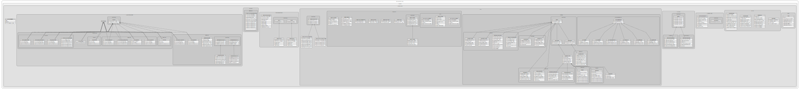

# Prysma: Rapport d’analyse fonctionnelle et organique

**Auteur :** Raphael Arseneault  
**Cours :** Épreuve Synthèse de programme (420-626-RK)

**Présenté à :**
- Monsieur Charles Lemaire
- Monsieur Jonathan Roy
- Monsieur Marcel Landry

**Département de techniques de l’informatique**  
*Cégep Rimouski*  
*25 mars 2026*


# Analyse Organique
## Pseudo code des algorithmes critiques 
### Algorithme de construction d’une instruction (ConstructeurArbreInstruction)
```cpp
INoeud construire(vecteur<Token>& tokens, int& index)
{
    // On récupère le parseur spécifique associé au type du token actuel dans le registre
    IParser parserAssocie = _registreInstructions.recuperer(tokens[index].type) ;
    // On délègue la tâche de parsing au parseur trouvé (ex: ParserVariable, ParserSi, etc.)
    // On passe le constructeur actuel pour permettre la récursivité
    INoeud enfant = parserAssocie.parser(tokens, index, cetteInstance) ;
    Retourner enfant ;
}
```

### Algorithme de parsing du noeud principal main
```cpp
INoeud parser(vecteur<Token>& tokens, int& index, ConstructeurArbreInstruction constructeur)
{
    NoeudMain noeudMain ;
    // On avance l'index de 2 pour sauter le mot-clé 'main' et l'accolade ouvrante '{'
    index += 2 ;
    // Tant qu'on n'est pas à la fin du fichier et qu'on ne rencontre pas l'accolade fermante '}'
    Tant que (index < tokens.taille() ET tokens[index].type != TOKEN_ACCOLADE_FERMEE)
    {
        // On demande au constructeur de bâtir l'instruction enfant à l'index actuel
        INoeud enfant = constructeur.construire(tokens, index) ;

        // On ajoute le noeud enfant généré à la liste des instructions du Main
        noeudMain.ajouterInstruction(enfant) ;
    }
    Retourner noeudMain ;
}
```

### Algorithme de construction de l'arbre d'équation récursif (ConstructeurArbreEquation)
```cpp
INoeud construire(vecteur<Token>& equation)
{
    // On nettoie l'équation en retirant les parenthèses inutiles autour de l'expression
    vecteur<Token> equationSansParentheses = _gestionnaireParenthese.enleverParenthesesEnglobantes(equation) ;
    equation = equationSansParentheses ;

    Si (equation.estVide())
    {
        Lancer Exception("Erreur: équation vide") ;
    }


    // On cherche l'opérateur avec la priorité la plus faible (racine actuelle)
    int indice = _chaineResponsabilite.trouverOperateur(equation) ;

    // Cas de base : Aucun opérateur trouvé, c'est une valeur numérique (feuille)
    Si (indice == -1)
    {
        Essayer
        {
            float valeurFloat = convertirEnFloat(equation[0].value) ;
            INoeud noeudValeur = creerNoeudValeur(valeurFloat) ;
            Retourner noeudValeur ;
        }
        Attraper (Exception e)
        {
            Lancer Exception("Erreur: impossible de convertir en nombre") ;
        }
    }


    // Cas récursif : On récupère le noeud correspondant à l'opérateur trouvé
    IExpression noeud = _registreSymbole.recupererNoeud(equation[indice].type) ;

    // On divise les tokens en deux parties : gauche et droite de l'opérateur
    vecteur<Token> gauche = extraireSousVecteur(equation, 0, indice) ;
    vecteur<Token> droite = extraireSousVecteur(equation, indice + 1, equation.fin()) ;

    // Appels récursifs pour construire les sous-arbres
    INoeud exprGauche = construire(gauche) ;
    INoeud exprDroite = construire(droite) ;

    // On lie les deux sous-arbres au noeud opérateur
    noeud.ajouterExpression(exprGauche, exprDroite) ;
    Retourner noeud ;
}
```

## Explication des entrées sortie. 
En entrée, le programme prend en charge un fichier source texte avec l'extension .prysma. Ce fichier contient les instructions du langage de haut niveau écrites par le développeur. Il est lu caractère par caractère pour être transformé en vecteur de tokens contenant les identifiants et les valeurs (string value) nécessaires à l'analyse. De plus, le compilateur accepte des arguments en ligne de commande (flags) pour configurer la compilation, comme le nom du fichier de sortie ou le niveau de verbosité du débogage.
En sortie, le compilateur génère principalement le code intermédiaire LLVM (IR) dans un fichier .ll. Ce code est la représentation bas niveau des instructions de l'arbre syntaxique. De plus, pour le débogage, le programme sort un affichage (dump) de l'AST et du code IR directement dans la console si l'argument correspondant est activé. En cas d'erreur de syntaxe, un message précis indiquant la ligne et le type d'erreur est retourné à l'utilisateur. Finalement, le backend LLVM produit le code machine exécutable optimisé pour l'architecture cible.

## Diagramme de classe 

 

### Architecture Globale des Classes

C'est la représentation de l'architecture logicielle complète du compilateur Prysma. L'objectif est de structurer le compilateur autour de modules fortement découplés, respectant les principes orientés objet pour garantir la robustesse et l'évolutivité du projet.

Aspects technologiques majeurs de la hiérarchie :

* **Arbre Syntaxique Abstrait (AST)** : Défini par des interfaces souches (`INoeud`, `IInstruction`). C'est la fondation qui standardise la représentation en mémoire des variables, boucles et fonctions.
* **Patron Visiteur (Visitor)** : Résout le problème de couplage en isolant les opérations de la structure de données. L'interface `IVisiteur` permet au backend LLVM de traverser l'arbre et de générer le code intermédiaire IR sans altérer l'intégrité de l'AST.
* **Moteur d'Analyse (Parsing)** : Divisé en parseurs spécialisés et piloté par un constructeur central. Chaque instruction gère son propre cycle d'évaluation syntaxique.
* **Gestion d'État et Registres** : Utilise une approche d'isolation pour le stockage des variables, symboles et types via des registres couplés à un allocateur d'arène (Arena), ce qui permet d'optimiser les performances mémoire.

La séparation stricte des responsabilités assure la stabilité structurelle. C'est un projet évolutif, l'ajout de fonctionnalités futures s'opérera par extensions isolées.


# Patron de conception utilisée pour la conception du projet

### 1. Composite avec Interpréteur
**Description :** C'est la structure centrale de l'Arbre Syntaxique Abstrait (AST). Les interfaces souches INoeud, IExpression et IInstruction définissent un contrat unifié. Les composants primitifs (littéraux, variables) et les structures complexes (fonctions, conditions, boucles) s'emboîtent de manière hiérarchique.
**Justification/Avantages :** Résout la problématique de la représentation en mémoire de la grammaire Turing-complète. L'arbre est manipulé de manière transparente, ce qui permet d'interpréter les relations sémantiques entre les blocs avant la compilation. La construction de cet AST représente une phase de compilation essentielle pour valider la syntaxe du code et rejeter les structures invalides.

### 2. Visiteur (Visitor)
**Description :** C'est le composant qui permet l'exécution et la génération. L'interface IVisiteur est implémentée par VisiteurGeneralGenCode (pour le backend LLVM) et VisiteurGeneralGraphViz. Il traverse l'AST en appliquant une logique spécifique à chaque type de nœud, isolé des données.
**Justification/Avantages :** Sépare strictement la structure de l'AST de la logique de génération du code intermédiaire LLVM IR. Cela permet de cibler plusieurs représentations (débogage graphique, assembleur) sans altérer l'intégrité des nœuds. L'ajout de nouvelles fonctionnalités au compilateur s'opère par extensions isolées, une démonstration de fiabilité.

### 3. Chaîne de Responsabilité (Chain of Responsibility)
**Description :** C'est la solution algorithmique pour la gestion des priorités mathématiques. Les classes ChaineResponsabilite et GestionnaireOperateur agissent comme des maillons de traitement. L'équation traverse ces maillons jusqu'à l'identification et la résolution de son opérateur spécifique.
**Justification/Avantages :** Élimine la complexité des conditions imbriquées dans l'analyseur lexical et syntaxique. C'est une architecture évolutive ; nous pouvons toujours ajouter des fonctionnalités supplémentaires (comme de nouveaux opérateurs) sans réécrire la logique centrale d'évaluation.

### 4. Stratégie (Strategy)
**Description :** C'est le moteur d'évaluation dynamique du compilateur. L'interface IStrategieEquation délègue l'analyse à des stratégies concrètes (StrategieIdentifiant, StrategieAppelFonction). Le compilateur sélectionne l'algorithme d'analyse au vol selon le type de token lu.
**Justification/Avantages :** Optimise les performances du compilateur en orientant le flux d'exécution directement vers la bonne logique de construction. Résout la complexité de l'analyse syntaxique en isolant chaque comportement pour gérer les erreurs de sémantique de manière efficace.

### 5. Monteur (Builder)
**Description :** Les classes ConstructeurArbreInstruction et ConstructeurEquationFlottante orchestrent l'instanciation des nœuds de l'AST. Ils encapsulent l'API C++ de LLVM, notamment l'arène d'allocation (BumpPtrAllocator).
**Justification/Avantages :** L'apprentissage technique a démontré l'importance de maîtriser les techniques pour gérer la mémoire. Ce patron centralise la configuration des objets et prévient les fuites mémoires en s'assurant que l'AST est robuste avant de générer la résolution d'une équation.

### 6. Façade (Facade)
**Description :** La classe LlvmBackend est l'unique implémentation du patron Façade. Elle encapsule les sous-systèmes natifs de l'API C++ de LLVM (llvm::LLVMContext, llvm::Module, llvm::IRBuilder, initialisation des cibles) derrière des méthodes simplifiées et spécifiques à Prysma (creerAutoCast, declarerExterne, chargerValeur).
**Justification/Avantages :** Résout le point de blocage potentiel lié à la complexité de la génération du code par le framework LLVM. Le frontend Prysma interagit avec une interface haut niveau sans avoir à manipuler la syntaxe brute de l'assembleur LLVM IR dans chaque nœud. L'apprentissage technique de l'API LLVM est strictement isolé dans ce composant.

### 7. Objet Contexte (Context Object / Service Locator)
**Description :** La structure ContextGenCode implémente le patron Objet Contexte. Elle encapsule l'état global d'une passe de compilation et regroupe les pointeurs vers les dépendances critiques (registres d'instructions, de variables, de types, backend LLVM, et l'arène d'allocation BumpPtrAllocator).
**Justification/Avantages :** Résout le problème de la gestion d'état lors du parcours récursif de l'Arbre Syntaxique Abstrait. Au lieu de surcharger les signatures des méthodes du VisiteurGeneralGenCode avec de multiples paramètres, l'objet contexte injecte l'environnement d'exécution de manière unifiée. C'est la conception d'une architecture de compilateur robuste : elle élimine le besoin de variables globales et prépare le projet à la compilation séparée de multiples fichiers de manière thread-safe.